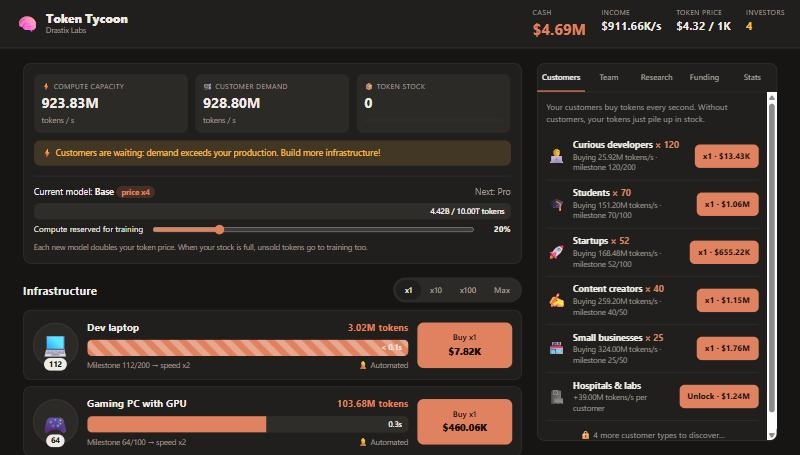

<div align="center">

# 🧠 Token Tycoon

**Run an AI lab: build data centers, sell tokens and train ever more powerful models.**

[](https://drastix235.github.io/token-tycoon/)




</div>

---

## 🎮 The game

You start with a single laptop and one curious developer. Your goal: build the biggest AI lab in the galaxy, from a 💻 dev laptop all the way to a 🛰️ orbital data center.

Everything revolves around **three balances**:

| | Role |
|---|---|
| ⚡ **Production** | Your machines produce tokens. |
| 🛒 **Demand** | Your customers (developers, startups, banks, governments… aliens) buy tokens every second. |
| 🧠 **Training** | A share of your compute trains the next model, which **doubles your token price**. |

Produce too much and your stock overflows. Too little and your customers wait. Train too much and you stop selling.

## ✨ Features

- 🏭 **10 machines** and **10 customer types**, with milestones that double speed and demand
- 🧠 **9 model generations**, from *Nano* to *Superintelligence*
- 👷 **SRE engineers** that automate production, even while the game is closed (up to 8 h)
- 🔬 **68 research projects**: Flash Attention, Mixture of Experts, quantization…
- 💼 **Fundraising** (prestige): start over with investors that boost your prices
- 💾 Auto-save · 🌗 light & dark themes · 📱 mobile friendly

## 🚀 Play

- **Online**: [drastix235.github.io/token-tycoon](https://drastix235.github.io/token-tycoon/)
- **Locally**: download the repo and open `index.html` in your browser. No install needed.

## 📁 Project structure

```
token-tycoon/
├── index.html        # Page structure
├── css/
│   └── style.css     # Styling (themes, responsive layout)
├── js/
│   └── game.js       # Game logic and balance
└── docs/
    └── screenshot.jpg
```

## 🛠️ Customize

All the balance settings live at the top of [`js/game.js`](js/game.js):

| Constant | Contents |
|---|---|
| `INFRA` | Machines: price, tokens produced, cycle duration |
| `CLIENTS` | Customer types and their demand |
| `MODELS` | AI models, training cost and price multiplier |
| `UPGRADES` | Research projects |
| `BASE_PRICE`, `STOCK_SECONDS`, `INVESTOR_BONUS` | General settings |

## 📄 License

Released under the [MIT License](LICENSE).
